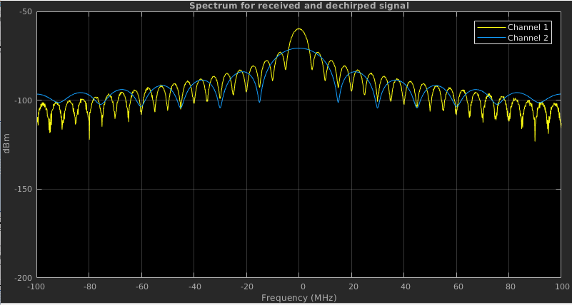
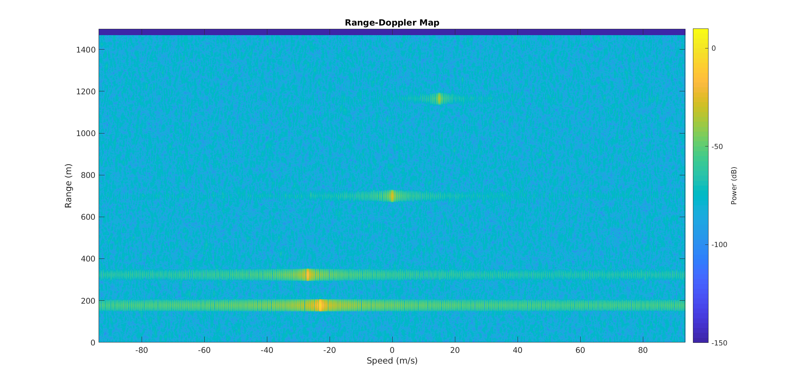

# Monostatic-Radar
Monostatic Radar simulated on MATLAB
Detects up to 4 targets and outputs both the distance from the target to the radar and the target's speed.
In the image below we can see the spectrum analyzer of the transmited and received pulse, dechirp.
And on the bottom there's the Range-Doppler-Map showing the detected targets.

